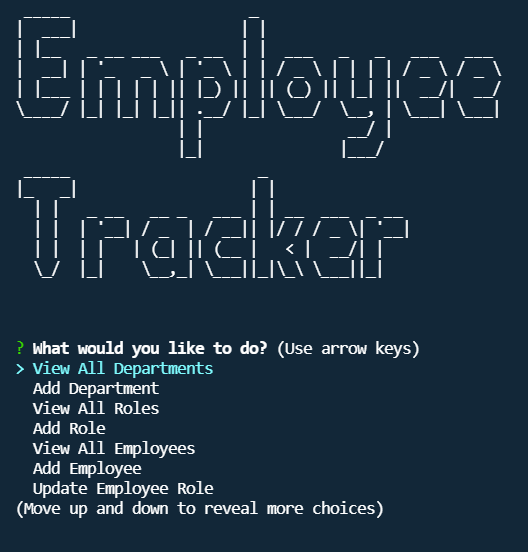

# SQL Employee Tracker


## Description

- Purpose of this project: To allow a business owner to view and manage the departments, roles, and employees in their company so that they can organize and plan their business
- Problem(s) the app solves: Not having a single app with all their business and employee information in one place.
- Languages used: JavaScript, SQL
- Brief description: A command-line application that allows the user to interact with database information to view and manage the departments, roles, and employees in a company.

## Table of Contents

- [Installation](#installation)
- [Usage](#usage)
- [License](#license)
- [Contributing](#contributing)
- [Tests](#tests)
- [Questions](#questions)
- [Links](#links)

## Installation

This app requires the installation of inquirer, mysql2, console.table, express, and dotenv to function. All are included in the package.json file and can be installed with the following input:

```bash
npm install
```

## Usage

The application is invoked from the command line with the following input:

```bash
node index.js
```

When the user starts the application, they are presented with the text "Employee Tracker". Beneath the text is the Main Menu with the following options: "View All Departments", "Add Department", "View All Roles", "Add Role", "View All Employees", "Add Employee", "Update Employee Role", "Update Employee Manager", "View Employees By Manager", "View Employees By Department", "Delete Department", "Delete Role", "Delete Employee", "View The Total Utilized Budget of a Department", and "Quit". When they choose to View All Departments, they are presented with a formatted table showing department names and department ids. When they choose to Add Department, they are prompted to enter the name of the department and that department is added to the database. When they choose to View All Roles, they are presented with the job title, role id, the department that role belongs to, and the salary for that role. When they choose to Add Role, they are prompted to enter the name, salary, and department for the role and that role is added to the database. When they choose to View All Employees, they are presented with a formatted table showing employee data, including employee ids, first names, last names, job titles, departments, salaries, and managers that the employees report to. When they choose to Add Employee, they are prompted to enter the employee’s first name, last name, role, and manager, and that employee is added to the database. When they choose to Update Employee Role, they are prompted to select an employee to update and their new role and this information is updated in the database. When they choose to Update Employee Manager, they are prompted to select which employee whose manager they would like to update and then select which employee is the new manager and this information is updated in the database. When they choose to View Employees By Manager, they are prompted to select an employee and they are presented with a formatted table showing the first and last names of the employees they manage. When they choose to View Employees By Department, they are prompted to select a department and they are presented with a formatted table showing the first and last names of the employees that are part of that department. When they choose to Delete Department, they are prompted to select a department to delete, and that department is deleted from the database. When they choose to Delete Role, they are prompted to select a role to delete, and that role is deleted from the database. When they choose to Delete Employee, they are prompted to select an employee to delete, and that employee is deleted from the database. If they choose View The Total Utilized Budget of a Department, they are prompted to choose a department, and then the sum of all the salaries of the employees in that department is displayed. If they choose "Quit", text appears thanking them for using the application, and the application exits.

### Screenshot



## License

This application is licensed under the MIT license.

## Contributing

If you would like to contribute to this application, please follow Creative Contribution guidelines.

## Tests

This application can be tested by entering unexpected inputs as responses to the prompts.

## Questions

If you have any questions:

- Email me: [meegan.r.anderson@gmail.com](mailto:meegan.r.anderson@gmail.com)
- Go to my github: [NotANewt](https://github.com/NotANewt)

## Links

- Here is the repo: [NotANewt/SQL Employee Tracker](https://www.github.com/NotANewt/hw12_sql_employee_tracker)
- Here is the walkthrough: [Walkthrough Video Link](https://drive.google.com/file/d/1oSujYGXvaIF7E6LM8NLM1sJqRhizYOkC/view)
